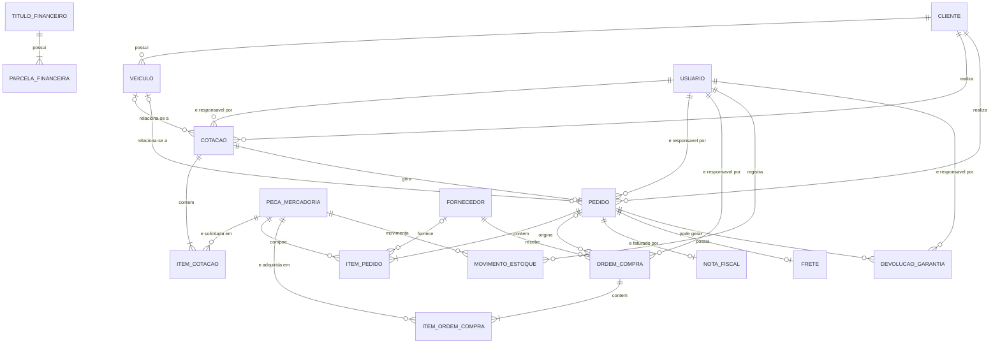
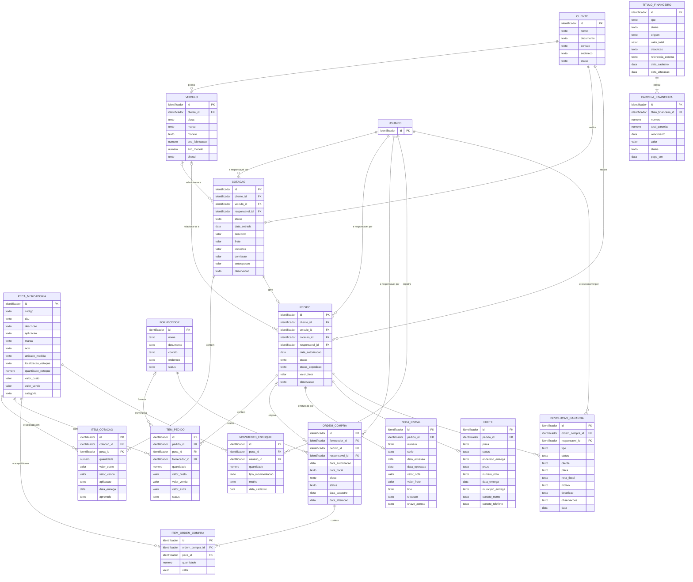

# Modelagem de Banco de Dados — CK Autoshop

Trabalho acadêmico de levantamento de requisitos e modelagem conceitual de banco de dados, desenvolvido a partir de entrevista realizada na empresa CK Autoshop.

## Metadados

| Campo | Informação |
|---|---|
| **Organização** | CK Autoshop |
| **Disciplina** | Modelagem de Banco de Dados (MBD) |
| **Integrantes** | *[preencher]* |
| **RGM** | *[preencher]* |
| **Data** | *[preencher]* |

---

## 1. Caracterização da Organização

### 1.1 A empresa

A **CK Autoshop** atua no segmento de peças e componentes automotivos. Sua operação envolve compra e venda de peças, atendimento a clientes empresariais, controle de estoque, expedição, transporte, faturamento e pós-venda.

A empresa trabalha principalmente no modelo **B2B (Business to Business)**, atendendo locadoras, frotistas, oficinas, seguradoras e empresas que administram frotas.

### 1.2 Entrevista e levantamento

A entrevista teve como objetivo entender o funcionamento da empresa: processos, setores envolvidos, informações registradas no sistema e dificuldades da operação.

A CK Autoshop possui **sistema próprio de gestão**, que controla cotações, compras, fornecedores, clientes, estoque, pedidos, notas fiscais, financeiro, devoluções, garantias e acompanhamento das operações.

**Perguntas aplicadas na entrevista:**

- **Cadastros:** Como uma peça é cadastrada? Como são cadastrados clientes/membros?
- **Compras:** Como uma compra é registrada? Quem compra? De quem compra? O que é comprado?
- **Estoque:** Como a peça entra no estoque? Como a peça sai do estoque? O que acontece com o estoque depois da venda? Como controlam produtos/estoque?
- **Vendas e pedidos:** Como uma venda é registrada? Quem vende? Para quem vende? Como registram vendas ou atendimentos? Como organizam pedidos?
- **Financeiro:** Como controlam pagamentos?
- **Pessoas e rotina:** Quem trabalha lá? Quem participa de cada etapa? Quais atividades são realizadas?
- **Sistemas e informações:** Quais informações são registradas no sistema? Usam papel, Excel, sistema?
- **Dificuldades:** Quais problemas enfrentam atualmente?

---

## 2. Processos de Negócio

### 2.1 Cadastro de peças
As peças são cadastradas com as informações necessárias para identificação e comercialização: código, descrição, marca/fabricante, aplicação, fornecedor, custo e valor de venda.

### 2.2 Cadastro de clientes e veículos
Os clientes são cadastrados e vinculados às operações comerciais. Também são registradas informações dos veículos: **placa, marca, modelo, ano** e **quilometragem**, quando necessária.

### 2.3 Cotação e venda
O processo comercial começa com a solicitação do cliente. A equipe pesquisa as peças, monta a cotação e define custo, margem e valor de venda. A cotação pode conter cliente, veículo, peças, quantidades, valores, descontos e demais custos.

**Status identificados:** `Pendente → Enviada → Aprovada/Reprovada → Cancelada`

Aprovada a cotação, o processo segue para o pedido.

**Fluxo:** `Cliente → Cotação → Aprovação → Pedido`

### 2.4 Compra
A compra é feita junto aos fornecedores e normalmente atende a uma necessidade de um pedido. É registrada por meio de uma **Ordem de Compra**, com fornecedor, itens, quantidades, valores, datas e pedido relacionado.

**Fluxo:** `Necessidade → Ordem de Compra → Fornecedor → Recebimento → Conferência → Estoque`

### 2.5 Controle de estoque
O estoque é controlado pelas entradas e saídas das peças, relacionadas a compras, pedidos e vendas. O controle permite acompanhar disponibilidade, quantidades, custos, fornecedores e movimentações. Existem processos específicos para **devoluções e garantias**.

**Fluxo:** `Entrada → Estoque → Separação → Saída`

### 2.6 Expedição, embalagem e despacho
Confirmada a disponibilidade das peças, a equipe de expedição faz separação, conferência, embalagem e despacho. São usados materiais de proteção como **plástico-bolha, fitas, papelão, isopor** e outros adequados ao tipo de peça. Depois da embalagem, o pedido segue para transporte.

**Fluxo:** `Pedido → Separação → Conferência → Embalagem → Despacho → Transporte → Entrega`

### 2.7 Processo financeiro
Envolve faturamento, notas fiscais e contas a receber. São acompanhados valor, desconto, valor líquido, vencimento, status e data de pagamento.

**Fluxo:** `Faturamento → Nota Fiscal → Conta a Receber → Vencimento → Pagamento`

### 2.8 Pós-venda
Após a entrega, a empresa acompanha a operação e trata situações como problemas no recebimento, devoluções e garantias.

**Fluxo:** `Entrega → Acompanhamento → Ocorrência/Devolução/Garantia (quando aplicável)`

### 2.9 Fluxogramas

Os processos descritos acima foram representados em três fluxogramas:

- **4.1** — Processo de Cotação e Venda
- **4.2** — Processo de Compra e Entrada no Estoque
- **4.3** — Processo de Separação, Embalagem, Expedição e Entrega

---

## 3. Problemas e Necessidades Identificados

O principal desafio apontado na entrevista é a **integração e a rastreabilidade das informações** ao longo da operação, que passa por cotação, compra, estoque, expedição, transporte, faturamento, financeiro e pós-venda.

Problemas levantados:

- Dificuldade de acompanhar o status dos pedidos;
- Atrasos de fornecedores e pedidos aguardando peças;
- Falta de visibilidade sobre prazos;
- Necessidade de controlar a margem real das vendas;
- Dificuldade de rastrear toda a operação;
- Informações espalhadas entre sistema, planilhas, PDFs e WhatsApp;
- Controle de devoluções e garantias;
- Necessidade de integração entre os setores;
- Rastreabilidade de documentos;
- Necessidade de indicadores para acompanhamento da operação.

### 3.1 Problema central

A CK Autoshop precisa de uma estrutura de informações que integre e permita rastrear as etapas da operação, facilitando o acompanhamento de pedidos, peças, compras, estoque, vendas, expedições, entregas e processos relacionados.

---

## 4. Requisitos do Sistema

Os requisitos vieram da entrevista, dos processos observados e das informações identificadas no sistema usado pela empresa.

### 4.1 Requisitos Funcionais

| ID | Requisito | Descrição |
|---|---|---|
| **RF01** | Cadastro de peças | Cadastrar e consultar peças, com as informações necessárias para identificação, aplicação e comercialização. |
| **RF02** | Cadastro de clientes | Cadastrar e consultar clientes para uso em cotações, pedidos e vendas. |
| **RF03** | Cadastro de veículos | Registrar veículos relacionados aos clientes, com placa, marca, modelo e ano. |
| **RF04** | Cadastro de fornecedores | Cadastrar e consultar fornecedores de peças automotivas. |
| **RF05** | Registro de cotações | Criar cotações relacionando cliente, veículo, peças, quantidades e valores. |
| **RF06** | Status das cotações | Acompanhar o andamento das cotações: pendente, enviada, aprovada, reprovada e cancelada. |
| **RF07** | Registro de pedidos | Gerar e acompanhar pedidos originados das operações comerciais. |
| **RF08** | Ordens de Compra | Registrar Ordens de Compra relacionando fornecedores, peças, quantidades e valores. |
| **RF09** | Recebimento e conferência | Registrar o recebimento e a conferência das peças adquiridas. |
| **RF10** | Entrada e saída de estoque | Registrar as movimentações de estoque e manter o controle das quantidades disponíveis. |
| **RF11** | Controle de expedição | Acompanhar separação, conferência, embalagem e despacho dos pedidos. |
| **RF12** | Faturamento e notas fiscais | Registrar e relacionar faturamento e notas fiscais aos pedidos e respectivas operações. |
| **RF13** | Transporte e entrega | Registrar e acompanhar informações de transporte e entrega dos pedidos. |
| **RF14** | Controle financeiro | Acompanhar valores, vencimentos, pagamentos e situações financeiras das operações. |
| **RF15** | Devoluções e garantias | Registrar e acompanhar processos de devolução e garantia de peças. |
| **RF16** | Consulta e rastreabilidade | Consultar histórico e situação das operações, facilitando a rastreabilidade de pedidos, peças e documentos. |

### 4.2 Requisitos Não Funcionais

| ID | Requisito | Descrição |
|---|---|---|
| **RNF01** | Segurança | Controlar o acesso às informações conforme os usuários e suas responsabilidades. |
| **RNF02** | Integridade dos dados | Manter de forma consistente os relacionamentos entre clientes, veículos, peças, pedidos, compras, estoque e demais operações. |
| **RNF03** | Usabilidade | Apresentar as informações de forma organizada e compreensível para os diferentes setores. |
| **RNF04** | Rastreabilidade | Permitir o acompanhamento do histórico das operações e de suas alterações. |
| **RNF05** | Disponibilidade | Estar disponível durante a operação da empresa. |

---

## 5. Regras de Negócio

Condições e restrições observadas no funcionamento da CK Autoshop que devem ser consideradas na organização dos dados.

| ID | Regra | Descrição |
|---|---|---|
| **RN01** | Identificação do cliente | Uma cotação ou pedido deve estar associado a um cliente. |
| **RN02** | Veículo | Quando a operação envolver um veículo, suas informações devem ser registradas e vinculadas ao cliente correspondente. |
| **RN03** | Itens da cotação | Uma cotação pode ter um ou mais itens, cada um relacionado a uma peça e contendo quantidade e valores. |
| **RN04** | Aprovação da cotação | Uma cotação aprovada pode dar continuidade ao processo e originar um pedido. |
| **RN05** | Ordem de Compra | Deve estar relacionada a um fornecedor e conter os itens que serão adquiridos. |
| **RN06** | Recebimento | As peças adquiridas devem ser recebidas e conferidas antes do registro de entrada no sistema. |
| **RN07** | Entrada no estoque | Após a conferência, a entrada da mercadoria deve ser registrada para atualizar o estoque. |
| **RN08** | Movimentação de estoque | As quantidades disponíveis devem ser atualizadas conforme as entradas e saídas registradas. |
| **RN09** | Saída de estoque | A saída de uma peça deve estar relacionada à operação que originou sua destinação, permitindo rastrear a movimentação. |
| **RN10** | Status dos pedidos | Os pedidos devem ter status representando sua situação dentro do processo operacional. |
| **RN11** | Expedição | Antes do despacho, os itens destinados ao cliente devem ser separados e conferidos. |
| **RN12** | Embalagem | As peças devem ser embaladas conforme suas características, com materiais de proteção adequados (plástico-bolha, papelão, isopor e fitas). |
| **RN13** | Devoluções e garantias | Devem ser registradas e tratadas como ocorrências específicas, não como vendas ou movimentações normais. |
| **RN14** | Faturamento | As informações de Nota Fiscal devem estar relacionadas à operação correspondente. |
| **RN15** | Financeiro | Os valores a receber devem ter informações que permitam acompanhar vencimento, pagamento e situação financeira. |
| **RN16** | Rastreabilidade | As operações devem manter informações suficientes para identificar origem, responsáveis e etapas realizadas. |

---

## 6. Modelagem Conceitual

As entidades foram identificadas a partir dos processos levantados na entrevista e das estruturas observadas no sistema da CK Autoshop. O modelo conceitual usa apenas as entidades do recorte principal da operação, sem reproduzir toda a complexidade do banco de dados existente.

### 6.1 Entidades e atributos

| Entidade | Descrição | Principais atributos |
|---|---|---|
| **Cliente** | Empresas atendidas pela CK Autoshop | ID do cliente; documento; nome/razão social; contato; endereço; status |
| **Veículo** | Veículo relacionado ao atendimento do cliente | ID do veículo; placa; marca; modelo; ano de fabricação; ano do modelo; chassi (quando aplicável) |
| **Peça/Mercadoria** | Produtos e peças automotivas comercializados | ID da peça; código; SKU; nome/descrição; aplicação; marca/fabricante; NCM; unidade de medida; localização no estoque; quantidade em estoque; valor de custo; valor de venda; categoria |
| **Fornecedor** | Empresas que fornecem peças para a CK Autoshop | ID do fornecedor; nome/razão social; documento; contato; endereço; status |
| **Usuário** | Pessoa responsável pelo registro e pelo acompanhamento das operações | ID do usuário *(demais atributos a levantar — ver seção 8.5)* |
| **Cotação** | Proposta comercial elaborada para o cliente | ID da cotação; cliente; responsável; status; placa/veículo; data de entrada; desconto; frete; impostos; comissão; antecipação; observação |
| **Item da Cotação** | Cada peça incluída em uma cotação | ID do item; ID da cotação; ID da peça; quantidade; valor de custo; valor de venda; aplicação; data de entrega; status de aprovação |
| **Pedido** | Operação comercial gerada após a aprovação da cotação | ID do pedido; cliente; veículo; cotação de origem; responsável; data de autorização; status; status da expedição; valor do frete; observação |
| **Item do Pedido** | Cada peça pertencente a um pedido | ID do item; ID do pedido; quantidade; descrição; valor de custo; valor de venda; valor adicional; status; fornecedor |
| **Ordem de Compra** | Aquisição de peças junto a um fornecedor | ID da Ordem de Compra; fornecedor/cliente relacionado; responsável; data de autorização; Nota Fiscal; placa; status; data de cadastro; data de alteração |
| **Item da Ordem de Compra** | Cada peça incluída em uma Ordem de Compra | ID do item; ID da Ordem de Compra; ID da peça; quantidade; valor |
| **Movimento de Estoque** | Entradas e saídas das peças no estoque | ID da movimentação; ID da peça; quantidade; tipo de movimentação; motivo; data de cadastro; usuário responsável |
| **Nota Fiscal** | Documento fiscal da operação | ID da Nota Fiscal; pedido; número; série; data de emissão; data da operação; valor da nota; valor do frete; tipo; situação; chave de acesso |
| **Frete** | Transporte e entrega da mercadoria | ID do frete; pedido; placa; status; endereço de entrega; prazo; número da nota; data de entrega; município de entrega; nome do contato; telefone do contato |
| **Devolução/Garantia** | Ocorrências de devolução ou garantia de peças | ID da ocorrência; Ordem de Compra relacionada; status; cliente; placa; Nota Fiscal; motivo; descrição; observações; data; responsável |
| **Título Financeiro** | Registros financeiros das operações | ID; tipo; status; origem; valor total; descrição; referência externa; data de cadastro; data de alteração |
| **Parcela Financeira** | Parcelas vinculadas aos títulos financeiros | ID; título financeiro; número; total de parcelas; vencimento; valor; status; data de pagamento |

> **Observação sobre a nomenclatura:** no banco da empresa essa estrutura aparece como **Mercadoria**. No modelo conceitual do trabalho usamos **Peça/Mercadoria**, já que "peça" é o termo empregado pela empresa na descrição dos processos.

### 6.2 Relacionamentos e cardinalidades

**Convenção adotada:** `1` (exatamente um) · `0..1` (zero ou um) · `1..N` (um ou vários) ·
`0..N` (zero ou vários). A leitura é *Entidade A → Entidade B*.

| Nº | Entidade A | Relacionamento | Entidade B | Cardinalidade | Justificativa |
|---|---|---|---|---|---|
| 1 | Cliente | possui | Veículo | `1 : 0..N` | Um cliente pode possuir zero ou vários veículos |
| 2 | Cliente | realiza | Cotação | `1 : 0..N` | RN01; o cadastro de cliente (RF02) é processo próprio, logo pode existir cliente sem cotação |
| 3 | Cliente | realiza | Pedido | `1 : 0..N` | RN01 — todo pedido deve estar associado a um cliente |
| 4 | Veículo | relaciona-se a | Cotação | `0..1 : 0..N` | RN02: o veículo é registrado quando a operação o envolve |
| 5 | Veículo | relaciona-se a | Pedido | `0..1 : 0..N` | RN02, que trata da operação de modo geral, não só da cotação |
| 6 | Cotação | contém | Item da Cotação | `1 : 1..N` | RN03: uma cotação possui um ou mais itens |
| 7 | Peça/Mercadoria | é solicitada em | Item da Cotação | `1 : 0..N` | Uma peça cadastrada pode ainda não ter sido cotada |
| 8 | Cotação | gera | Pedido | `1 : 0..1` | RN04; nem toda cotação vira pedido |
| 9 | Pedido | contém | Item do Pedido | `1 : 1..N` | Um pedido possui um ou vários itens |
| 10 | Peça/Mercadoria | compõe | Item do Pedido | `1 : 0..N` | Uma peça pode não estar em nenhum pedido |
| 11 | Fornecedor | fornece | Item do Pedido | `0..1 : 0..N` | O fornecedor do item é informado quando a operação exige |
| 12 | Fornecedor | recebe | Ordem de Compra | `1 : 0..N` | RN05: toda OC está relacionada a um fornecedor |
| 13 | Pedido | origina | Ordem de Compra | `0..1 : 0..N` | Seção 2.4 e RN05: como cada OC tem um só fornecedor e cada item do pedido pode ter fornecedor diferente, um pedido pode originar várias OCs |
| 14 | Ordem de Compra | contém | Item da Ordem de Compra | `1 : 1..N` | RN05: a OC contém os itens que serão adquiridos |
| 15 | Peça/Mercadoria | é adquirida em | Item da Ordem de Compra | `1 : 0..N` | Uma peça pode nunca ter sido comprada |
| 16 | Peça/Mercadoria | movimenta | Movimento de Estoque | `1 : 0..N` | RN08; peça recém-cadastrada pode não ter movimentação |
| 17 | Pedido | é faturado por | Nota Fiscal | `1 : 0..1` | RN14 e RF12; o pedido pode ainda não ter sido faturado |
| 18 | Pedido | possui | Frete | `1 : 0..1` | Seção 2.6 e RF13; nem todo pedido tem transporte registrado |
| 19 | Pedido | pode gerar | Devolução/Garantia | `1 : 0..N` | RN13 e seção 2.8 — ver ressalva na seção 8.5 |
| 20 | Título Financeiro | possui | Parcela Financeira | `1 : 1..N` | RN15: toda parcela pertence a um título |
| 21 | Usuário | é responsável por | Cotação | `1 : 0..N` | RN16 e RNF01 |
| 22 | Usuário | é responsável por | Pedido | `1 : 0..N` | RN16 e RNF01 |
| 23 | Usuário | é responsável por | Ordem de Compra | `1 : 0..N` | RN16 e RNF01 |
| 24 | Usuário | registra | Movimento de Estoque | `1 : 0..N` | RN16: identificar quem realizou o registro |
| 25 | Usuário | é responsável por | Devolução/Garantia | `1 : 0..N` | RN16 e RNF01 |

---

## 7. Dicionário de Dados Conceitual

O dicionário de dados apresenta, para cada uma das 17 entidades do modelo conceitual, os
atributos utilizados, sua descrição e a regra de negócio associada. Por ser um conteúdo extenso,
foi organizado em um arquivo próprio:

[📄 Acessar o Dicionário de Dados Conceitual](dicionario-dados.html)

---

## 8. Diagrama Entidade-Relacionamento (DER)

O DER representa o modelo conceitual da CK Autoshop na notação **Crow's Foot**, em Mermaid
(renderizado pelo GitHub). São **17 entidades** e **25 relacionamentos**, exatamente os da
seção 6. As decisões de modelagem estão explicadas na seção 8.4.

### 8.1 Visão geral dos relacionamentos

Versão sem atributos, para leitura do fluxo principal:

### 8.2 DER completo com atributos

### 8.3 Legenda da notação

| Símbolo | Leitura |
|---|---|
| `\|\|` | exatamente um (obrigatório) |
| `\|o` | zero ou um (opcional) |
| `o{` | zero ou vários |
| `\|{` | um ou vários (obrigatório) |
| **PK** | atributo identificador da entidade |
| **FK** | atributo que referencia outra entidade |

### 8.4 Decisões de modelagem

**1. Criação da entidade Item da Ordem de Compra**

O relacionamento entre Ordem de Compra e Peça é N:N — uma ordem compra várias peças e uma peça é
comprada em várias ordens. Sem entidade associativa não há onde registrar quantidade e valor de
cada item. É a mesma estrutura já usada em Item da Cotação e Item do Pedido. Os atributos
`quantidade` e `valor` vêm da seção 2.4, que descreve a Ordem de Compra como contendo "fornecedor,
itens, quantidades, valores, datas e pedido relacionado".

**2. Criação da entidade Usuário**

Cinco entidades (Cotação, Pedido, Ordem de Compra, Movimento de Estoque e Devolução/Garantia)
guardam `responsavel_id` ou `usuario_id`. Sem a entidade, essas referências não apontam para lugar
nenhum. **RN16** exige identificar os responsáveis pelas operações e **RNF01** exige controlar o
acesso conforme os usuários e suas responsabilidades — ou seja, a informação faz parte do escopo
levantado. Por isso a entidade foi incluída com o identificador; os demais atributos ainda não
foram levantados (seção 8.5).

**3. Relacionamentos documentados a partir dos atributos existentes**

Quatro relacionamentos estavam implícitos nos atributos do dicionário mas não constavam da tabela
de cardinalidades. Foram documentados:

| Relacionamento | O que sustenta |
|---|---|
| Cliente → Pedido | RN01 e o atributo `cliente_id` do Pedido |
| Veículo → Pedido | RN02 e os dados de veículo que o Pedido registrava |
| Fornecedor → Item do Pedido | atributo `fornecedor_id` — "quando a operação exigir" |
| Pedido → Ordem de Compra | atributo `pedido_id` da OC e a seção 2.4 |

**4. Remoção de atributos redundantes**

- **Pedido:** `nota_fiscal` e `data_nota_fiscal` saíram, porque o relacionamento com Nota Fiscal e
  os campos `numero` e `data_emissao` dessa entidade já cobrem a informação (RN14).
- **Pedido:** `placa`, `marca`, `modelo` e `ano_modelo` saíram, substituídos por `veiculo_id`.
  Eram cópia dos dados de Veículo, contrariando RN02.
- **Nota Fiscal** e **Frete** ganharam `pedido_id`, que materializa relacionamentos já existentes
  na seção 6.2.

**5. Convenção de cardinalidade**

A seção 6.2 misturava `1:N`, `1:0..1` e `1:0..N`. Foi padronizada a notação explícita
(`1`, `0..1`, `1..N`, `0..N`), que distingue participação obrigatória de opcional.

### 8.5 Pontos que ainda precisam ser validados

Questões que o material levantado não permite decidir. Devem ser confirmadas com a empresa antes
da Entrega 2.

1. **Origem da Devolução/Garantia.** A seção 6.2 liga a ocorrência ao Pedido; a seção 2.8 trata
   devolução e garantia como pós-venda; os atributos `cliente`, `placa` e `nota_fiscal` são dados
   do lado da venda. Por outro lado, o atributo se chama `ordem_compra_id` e o fluxograma 4.2 mostra
   "resolver divergência com o fornecedor". A estrutura atual foi mantida provisoriamente.
   **Confirmar:** o registro cobre a devolução do cliente para a CK, a da CK para o fornecedor, ou
   as duas situações?
2. **Atributos da entidade Usuário.** A entidade é exigida por RN16 e RNF01, mas nome, setor e
   perfil de acesso não foram levantados.
3. **Vínculo do Título Financeiro.** O atributo `origem` é texto livre e `tipo` sugere que existem
   títulos a receber e a pagar — origens diferentes (Nota Fiscal/Pedido num caso, Ordem de Compra no
   outro). Nenhum relacionamento foi criado. **Confirmar:** o sistema controla contas a pagar?
4. **Movimento de Estoque e RN09.** A regra exige ligar a saída à operação que a originou, mas a
   entidade só tem `motivo` (texto). Falta uma referência à operação.
5. **Nota Fiscal de entrada e de saída.** `ORDEM_COMPRA.nota_fiscal` é a nota do fornecedor,
   documento diferente da nota de venda. O atributo `tipo` da entidade Nota Fiscal permitiria cobrir
   os dois casos, mas isso não está registrado. **Confirmar** o alcance da entidade.
6. **Campos de nota ainda duplicados.** `FRETE.numero_nota` e `DEVOLUCAO_GARANTIA.nota_fiscal`
   continuam como texto. Dependem da definição dos itens 1 e 5.
7. **Entrega parcial de pedido.** Foi adotado `Pedido 1 : 0..1 Frete`, conforme o levantamento. Se a
   CK despacha um mesmo pedido em mais de uma remessa, a cardinalidade correta é `1 : 0..N`.
8. **`ORDEM_COMPRA.placa` e "fornecedor/cliente relacionado".** Não está claro por que uma ordem de
   compra guardaria dados de cliente e de veículo. Os campos foram mantidos sem relacionamento.
9. **Quilometragem do veículo.** Citada no processo (seção 2.2), ausente dos atributos de Veículo.

---

## 9. Justificativa Técnica

A modelagem conceitual da CK Autoshop foi desenvolvida com base na entrevista realizada, nos
processos identificados e nas informações observadas no sistema da empresa. O modelo representa os
principais processos de clientes, veículos, peças, cotações, pedidos, compras, estoque, faturamento,
transporte, financeiro e pós-venda.

As entidades e relacionamentos foram definidos de acordo com esses processos e suas regras de
negócio. A separação entre operações e seus respectivos itens, como **Cotação e Item da Cotação** e
**Pedido e Item do Pedido**, permite representar diferentes peças e quantidades em uma mesma
operação.

O **Movimento de Estoque** foi utilizado para registrar entradas e saídas das peças, permitindo
maior rastreabilidade das movimentações. As entidades relacionadas a **Nota Fiscal**, **Frete** e
**Financeiro** representam as etapas posteriores à venda.

O modelo não busca reproduzir todo o banco de dados existente na empresa, mas representar de forma
conceitual os principais processos analisados, mantendo uma estrutura organizada e adequada para a
futura transformação em modelo lógico e implementação SQL.

---

## 10. Uso de Inteligência Artificial

Durante o desenvolvimento deste projeto foram utilizadas ferramentas de Inteligência Artificial
como apoio às atividades de análise, organização, modelagem e documentação das informações
levantadas sobre a CK Autoshop.

Foram utilizadas principalmente duas ferramentas: **ChatGPT**, para apoio na análise e estruturação
do conteúdo do projeto, e **Claude**, utilizado principalmente como apoio na formatação e
organização do arquivo.

A utilização das ferramentas de IA não substituiu o levantamento realizado junto à organização.
As informações sobre os processos, atividades e funcionamento da empresa foram obtidas por meio de
entrevista, observação dos processos e análise das informações disponibilizadas pela organização.

### 10.1 Ferramentas utilizadas

**ChatGPT** — usado como apoio nas etapas de análise e modelagem, principalmente em:

- organização das informações obtidas durante a entrevista;
- identificação e descrição dos processos de negócio;
- elaboração e revisão dos fluxogramas;
- identificação dos requisitos funcionais e não funcionais;
- identificação e organização das regras de negócio;
- levantamento preliminar de entidades e atributos;
- estruturação do dicionário de dados;
- análise dos relacionamentos e cardinalidades;
- revisão da coerência da modelagem;
- organização e revisão dos textos da documentação.

**Claude** — usado principalmente como apoio à formatação e organização do arquivo, na apresentação
visual e estrutural do conteúdo produzido durante o projeto:

- organização da estrutura do documento;
- padronização da formatação;
- organização de títulos e subtítulos;
- melhoria da apresentação visual;
- ajustes de estrutura e layout do arquivo;
- revisão da organização do conteúdo para a entrega.

### 10.2 Exemplos de prompts utilizados

| # | Finalidade | Prompt |
|---|---|---|
| 1 | Identificação dos processos de negócio | "Com base nas informações levantadas durante a entrevista com a empresa, identifique os principais processos de negócio envolvidos na compra, venda, estoque, expedição, transporte, faturamento e pós-venda de peças automotivas." |
| 2 | Organização do processo de cotação e venda | "Com base nas informações fornecidas sobre o processo de cotação e venda da empresa, organize as etapas do processo de forma sequencial e identifique os principais pontos de decisão." |
| 3 | Elaboração do fluxograma | "Com base neste processo, monte um fluxograma contendo início, atividades, decisões e fim, utilizando uma estrutura adequada para um trabalho acadêmico de modelagem de banco de dados." |
| 4 | Levantamento de requisitos | "A partir dos processos e problemas identificados na empresa, levante os requisitos funcionais e não funcionais que o sistema deve atender. Considere apenas informações compatíveis com os processos apresentados." |
| 5 | Identificação das regras de negócio | "Com base nas informações da entrevista, identifique as principais regras de negócio relacionadas aos processos de compra, venda, estoque, expedição, faturamento e pós-venda. Não invente regras que não tenham sido informadas." |
| 6 | Identificação de entidades e atributos | "Com base nos processos levantados e nas informações fornecidas sobre o funcionamento da empresa e do sistema, identifique as principais entidades e seus possíveis atributos para um modelo conceitual de banco de dados." |
| 7 | Análise dos relacionamentos | "Analise estas entidades e identifique quais relacionamentos existem entre elas. Sugira também as cardinalidades, considerando as regras de negócio apresentadas." |
| 8 | Revisão do modelo | "Analise esta modelagem conceitual e identifique possíveis erros, principalmente relacionamentos inadequados, entidades desnecessárias e cardinalidades incorretas. Aponte o que deve ser corrigido e explique o motivo." |
| 9 | Dicionário de dados | "Organize as entidades e atributos identificados em um dicionário de dados conceitual preliminar, contendo o atributo, sua descrição e a regra de negócio relacionada." |
| 10 | Formatação do documento | "Organize e formate este conteúdo para apresentação acadêmica, mantendo as informações originais, estruturando títulos, subtítulos, tabelas e seções de forma clara e padronizada." |

O prompt 10 foi utilizado principalmente com o Claude, devido à sua utilização no processo de
organização e formatação do arquivo.

### 10.3 Processo de utilização

A utilização das ferramentas ocorreu de maneira iterativa. Primeiro foram levantadas as informações
sobre a organização e seus processos. Depois, essas informações foram fornecidas às ferramentas de
IA para auxiliar na organização, análise e estruturação do conteúdo.

As respostas geradas foram analisadas pelos integrantes do projeto. Quando foram identificadas
informações incorretas, incompletas ou que não correspondiam ao funcionamento real da organização,
elas foram corrigidas, ajustadas ou descartadas.

Na modelagem do banco de dados, as sugestões da IA foram usadas como apoio e passaram por revisão
dos integrantes, principalmente na definição das entidades, atributos, relacionamentos e regras de
negócio.

### 10.4 Responsabilidade pelas informações

A Inteligência Artificial foi utilizada como ferramenta de apoio, não como fonte primária das
informações sobre a organização.

Os dados referentes ao funcionamento da CK Autoshop foram obtidos por meio do levantamento
realizado junto à empresa. As decisões finais sobre processos de negócio, requisitos, regras de
negócio e elementos da modelagem foram tomadas pelos integrantes do projeto.

O uso do ChatGPT e do Claude teve como objetivo auxiliar na análise, estruturação, revisão e
apresentação das informações, mantendo a validação humana sobre o conteúdo final do trabalho.
